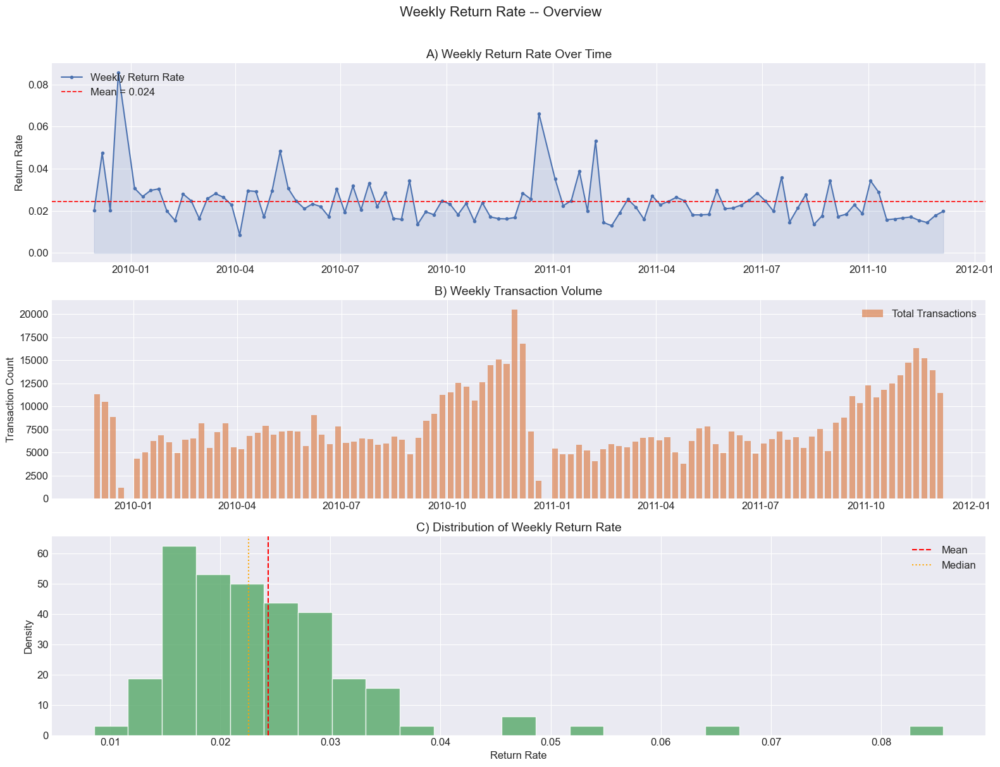
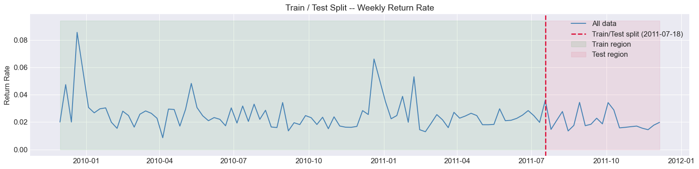
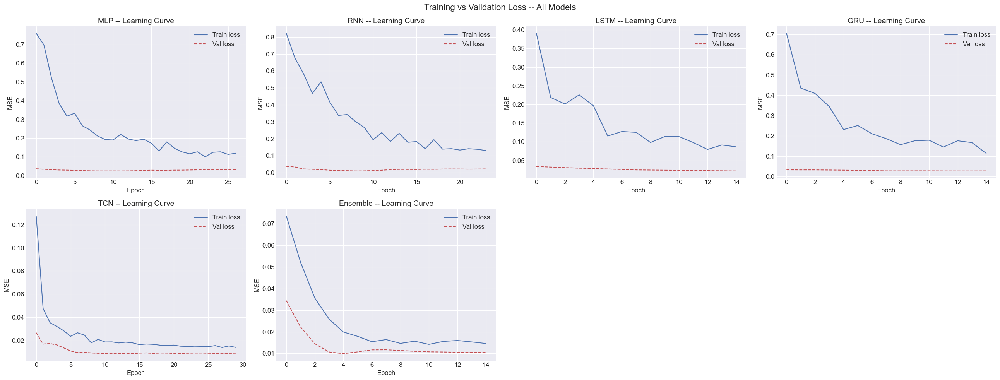
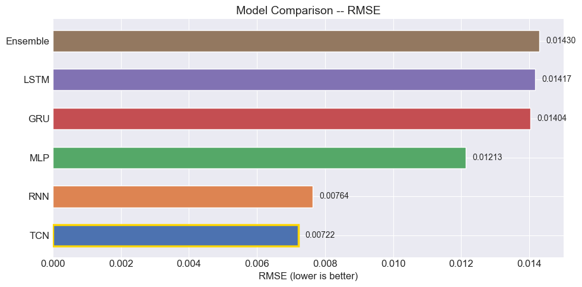
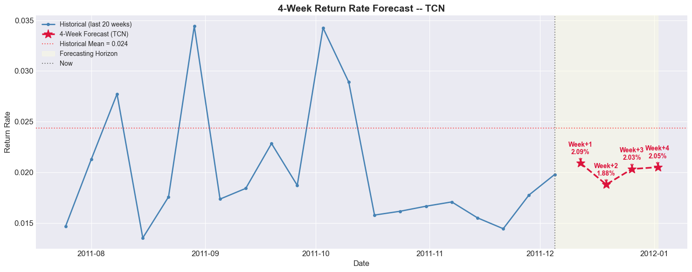
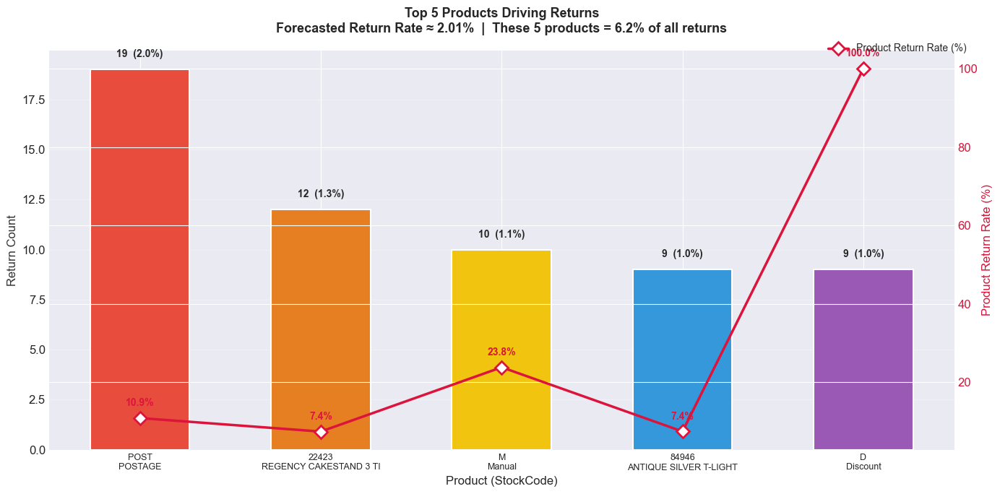

# Forecasting Pipeline Dashboard

This document highlights the key visual insights and performance metrics generated by our deep learning forecasting pipeline.

### 1. Exploratory Data Analysis & Overview
Overview of the historical return rates, transaction volumes, and distribution metrics.

### 2. Train vs Test Split
Chronological 80/20 data split ensuring our models are tested on strictly unseen future data.

### 3. Model Learning Curves
Training and validation loss across 100 epochs for all evaluated architectures (MLP, RNN, LSTM, GRU, TCN, and Stacked Ensemble).

### 4. Performance Comparison
Final evaluation ranking models by Root Mean Squared Error (RMSE) on the test set.

### 5. Future Return Rate Forecast
Our dynamic prediction utilizing the best performing model to evaluate return rates across the upcoming 4-week horizon.

### 6. Top 5 Products Analysis
Actionable insights defining which 5 specific inventory items are driving the majority of current returns.

